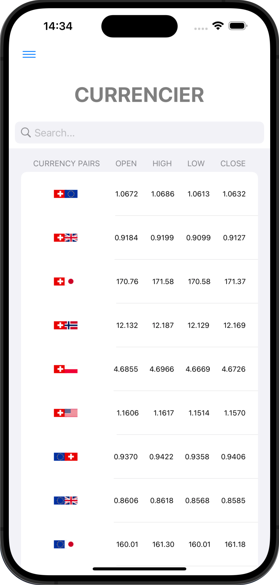
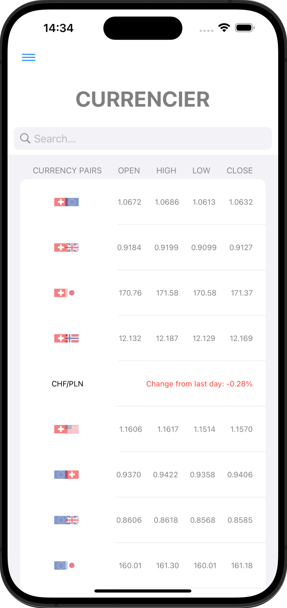
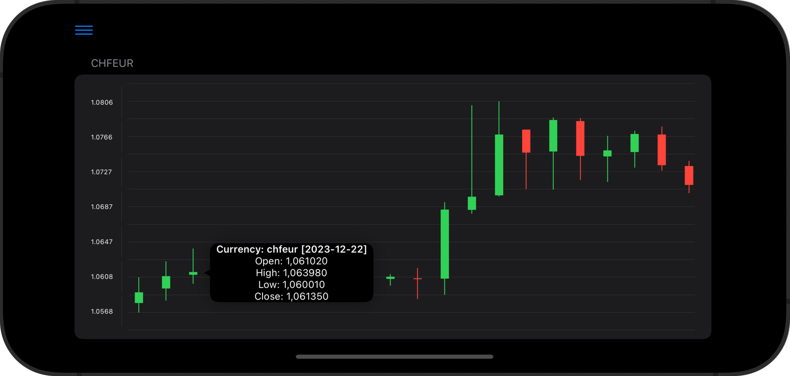
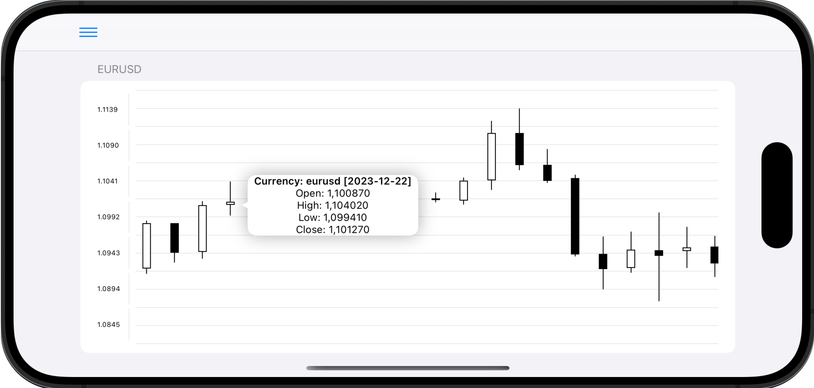
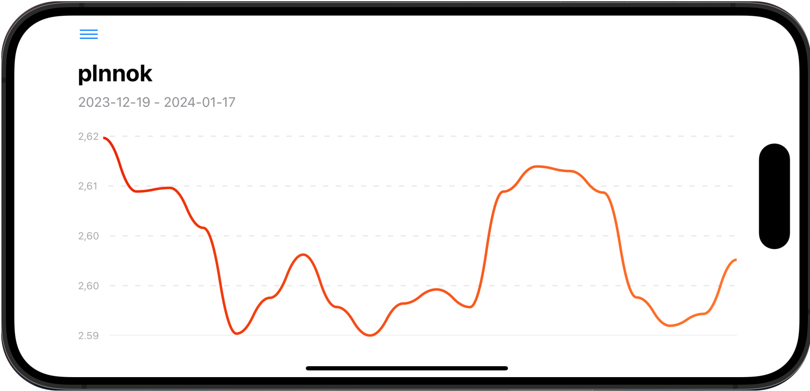
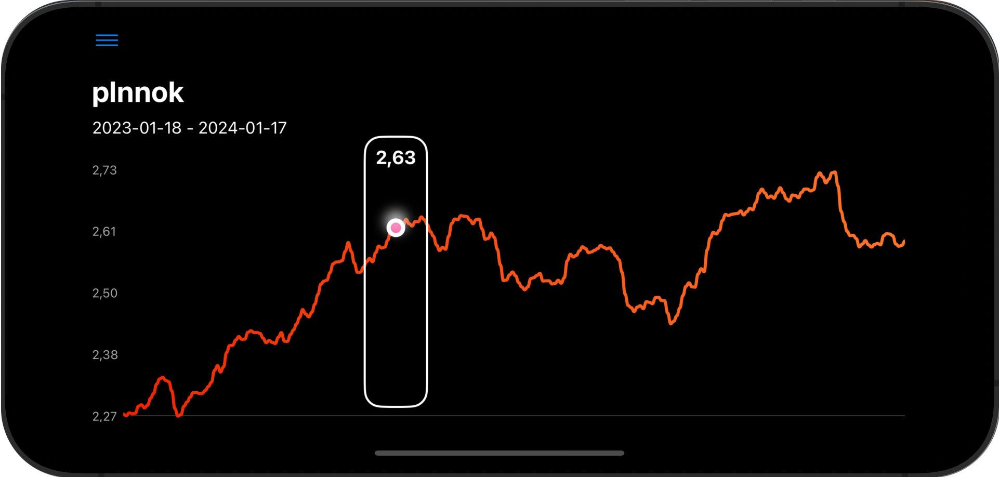
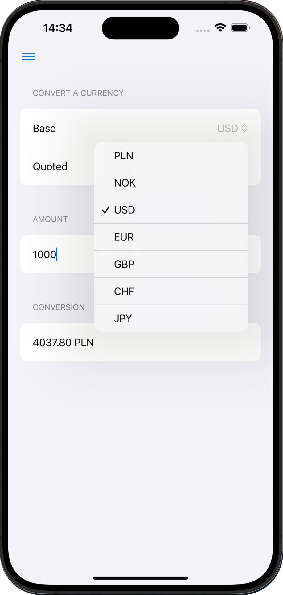
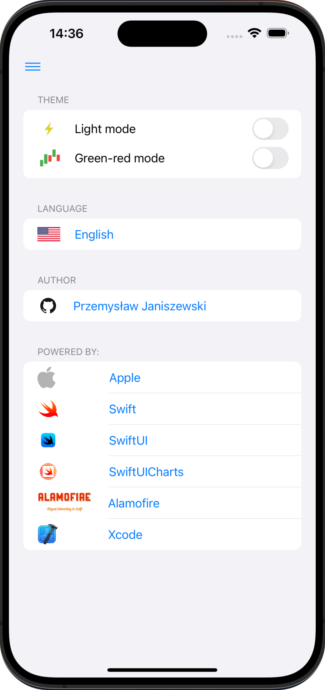

<h2>Forex Market Tracking Application</h2>

<h3>Functionalities:</h3>

- The ability to check real currency exchange rates retrieved through an API once a day and cached in the phone's memory - source: https://stooq.com/

     

___

- Candlestick charts with the ability to check opening, closing, and the highest and lowest prices for a specific currency on a given day, presented in two color schemes:

    

GREEN-RED

 

    

BLACK-WHITE

___

- Line charts were created using SwiftUICharts:

    

 

    

___

- Converter for selected currency pairs:
- Language selection option (English/Polish)
- Color theme selection option - light/dark
- Author information and source pages

     

___

Available currency pairs:

    

        <table >
                <tr>
                    <th>&nbsp;</th>
                    <th>PLN</th>
                    <th>USD</th>
                    <th>EUR</th>
                    <th>GBP</th>
                    <th>NOK</th>
                    <th>CHF</th>
                    <th>JPY</th>
                </tr>
                <tr>
                    <th>PLN</th>
                    <td>-</td>
                    <td>PLN/USD</td>
                    <td>PLN/EUR</td>
                    <td>PLN/GBP</td>
                    <td>PLN/NOK</td>
                    <td>PLN/CHF</td>
                    <td>PLN/JPY</td>
                </tr>
                <tr>
                    <th>USD</th>
                    <td>USD/PLN</td>
                    <td>-</td>
                    <td>USD/EUR</td>
                    <td>USD/GBP</td>
                    <td>USD/NOK</td>
                    <td>USD/CHF</td>
                    <td>USD/JPY</td>
                </tr>
                <tr>
                    <th>EUR</th>
                    <td>EUR/PLN</td>
                    <td>EUR/USD</td>
                    <td>-</td>
                    <td>EUR/GBP</td>
                    <td>EUR/NOK</td>
                    <td>EUR/CHF</td>
                    <td>EUR/JPY</td>
                </tr>
                <tr>
                    <th>GBP</th>
                    <td>GBP/PLN</td>
                    <td>GBP/USD</td>
                    <td>GBP/EUR</td>
                    <td>-</td>
                    <td>GBP/NOK</td>
                    <td>GBP/CHF</td>
                    <td>GBP/JPY</td>
                </tr>
                <tr>
                    <th>NOK</th>
                    <td>NOK/PLN</td>
                    <td>NOK/USD</td>
                    <td>NOK/EUR</td>
                    <td>NOK/GBP</td>
                    <td>-</td>
                    <td>NOK/CHF</td>
                    <td>NOK/JPY</td>
                </tr>
                <tr>
                    <th>CHF</th>
                    <td>CHF/PLN</td>
                    <td>CHF/USD</td>
                    <td>CHF/EUR</td>
                    <td>CHF/GBP</td>
                    <td>CHF/NOK</td>
                    <td>-</td>
                    <td>CHF/JPY</td>
                </tr>
                <tr>
                    <th>JPY</th>
                    <td>JPY/PLN</td>
                    <td>JPY/USD</td>
                    <td>JPY/EUR</td>
                    <td>JPY/GBP</td>
                    <td>JPY/NOK</td>
                    <td>JPY/CHF</td>
                    <td>-</td>
                </tr>
            </table>
        

    

